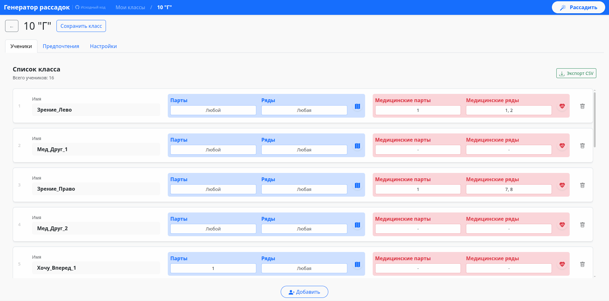
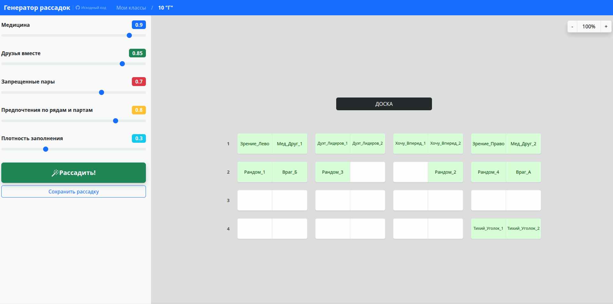
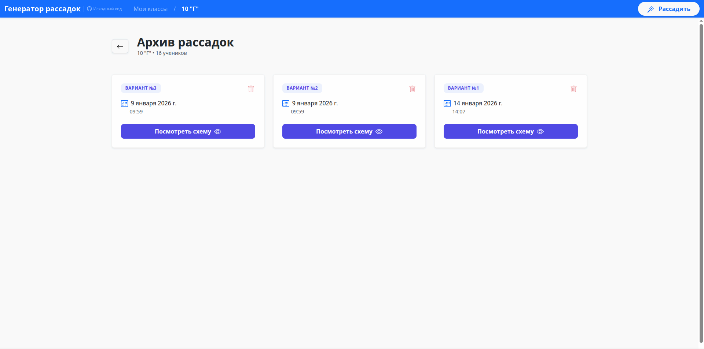
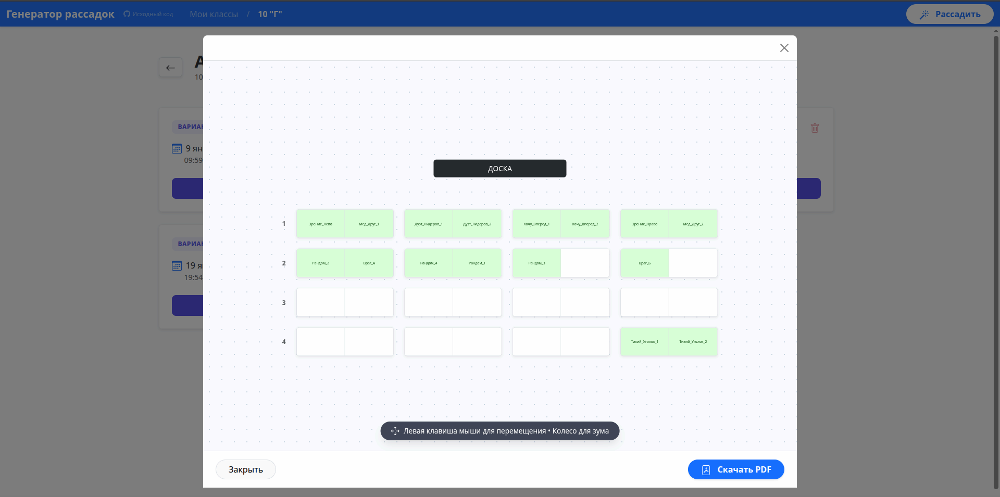

# 🎓 Генератор рассадки

[](https://github.com/chashkakefira/seating-generator-backend/actions/workflows/docker-image.yml)
[](https://github.com/chashkakefira/seating-generator-frontend/actions/workflows/docker-image.yml)


Данный репозиторий объединяет компоненты генератора рассадок. В основе решения лежит **меметический алгоритм** — гибридная стратегия, сочетающая глобальный поиск (генетический алгоритм) для нахождения оптимальных зон и локальный поиск.

---

## 🏗 Структура проекта

Система построена на базе микросервисной архитектуры:

- **[Backend](https://github.com/chashkakefira/seating-generator-backend)** — сервер на Go. Принимает данные класса, запускает меметический алгоритм и отдает готовый вариант рассадки.
- **[Frontend](https://github.com/chashkakefira/seating-generator-frontend)** — клиент на **Vue.js**. Позволяет визуализировать рассадки, настраивать ограничения и управлять процессом генерации.

---

## 📸 Интерфейс системы

<p align="center">
  
  
  
  
  
</p>

---

## 📊 Ссылка на презентацию к проекту

Презентация сделана с помощью Slidev и собирается автоматически с помощью Github Actions. Посмотреть ее можно [здесь](https://presentation.seating-generator.ru/), скачать [здесь](https://presentation.seating-generator.ru/presentation.pdf) в формате PDF

## ⚙️ Автоматизация сборки (CI/CD)

Для обеспечения надежности и воспроизводимости результатов используется **GitHub Actions**. Пайплайн автоматизации включает:

- Сборку и тестирование исходного кода.
- Создание и публикацию Docker-образов: `seating-generator-backend` и `seating-generator-frontend` в GitHub Container Registry (GHCR).

---

## 🚀 Запуск системы

Для развертывания проекта на локальном компьютере необходим **Docker** и **Docker Compose**. Сборка из исходников не требуется — система автоматически загрузит готовые образы.

### 1. Запуск контейнеров

Клонируйте репозиторий и выполните команду в корневой папке:

```bash
# клонируем репозиторий
git clone https://github.com/chashkakefira/seating-generator
# переходим в папку с репозиторием
cd seating-generator
# запускаем Docker контейнеры
docker compose up --pull always
```

### 2. Доступ к приложению

- Frontend (Интерфейс): http://localhost:8092
- Backend (API): http://localhost:8091

### 3. Остановка контейнеров

Для корректного завершения работы используйте:

```bash
docker compose down
```

## ⚖️ Лицензия и авторство
Проект распространяется под лицензией GNU Affero General Public License v3.0 (AGPLv3). Это означает, что любые изменения кода должны быть опубликованы под той же лицензией.

Автор: Прокофьев Даниил <danieldzen@yandex.ru>

Подробности: См. файлы [LICENSE](./LICENSE) и [NOTICE](./NOTICE).

Copyright (C) 2026
