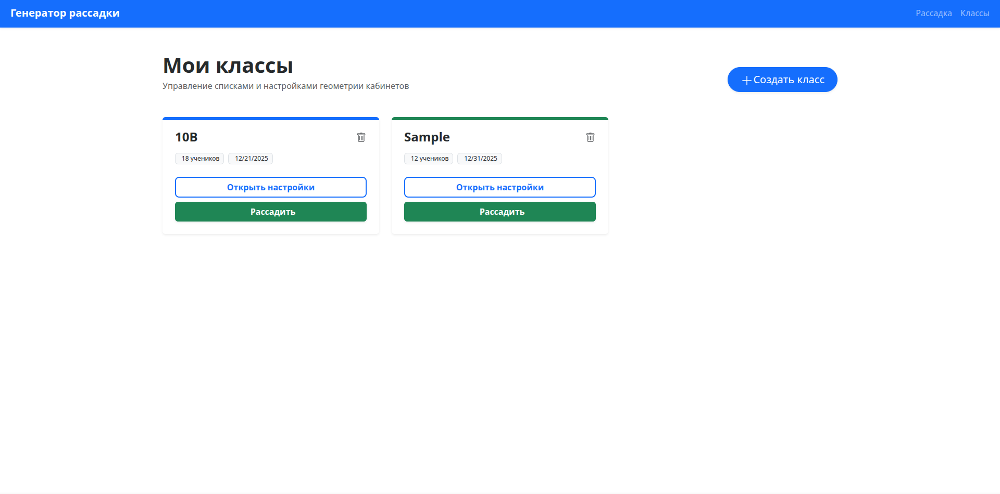
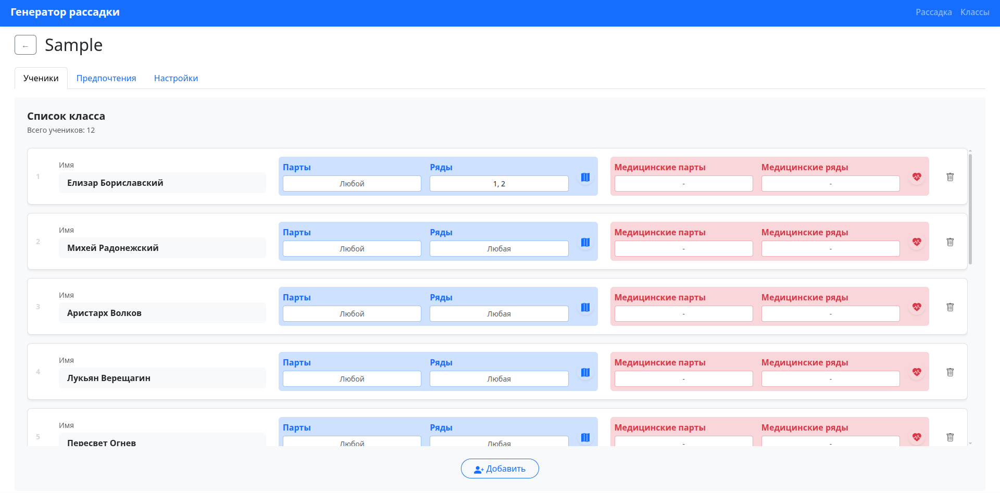
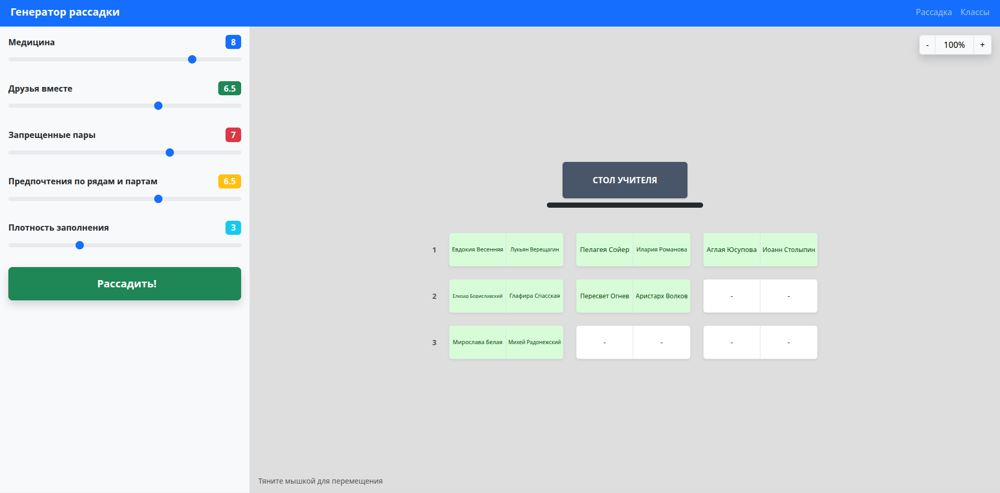

# 🎓 Гибридный алгоритм оптимизации рассадки учащихся

[](https://github.com/chashkakefira/seating-generator-backend/actions/workflows/docker-image.yml)
[](https://github.com/chashkakefira/seating-generator-frontend/actions/workflows/docker-image.yml)


Данный мета-репозиторий объединяет компоненты системы генерации рассадок. В основе решения лежит **меметический алгоритм** — гибридная стратегия, сочетающая глобальный поиск (генетический алгоритм) для нахождения оптимальных зон и локальный поиск.

---

## 🏗 Структура проекта

Система построена на базе микросервисной архитектуры:

- **[Вычислительное ядро (Backend)](https://github.com/chashkakefira/seating-generator-backend)** — высокопроизводительный сервер на **Go**. Отвечает за выполнение эволюционных вычислений и обработку бизнес-логики.
- **[Интерфейс пользователя (Frontend)](https://github.com/chashkakefira/seating-generator-frontend)** — интерактивное приложение на **Vue.js**. Позволяет визуализировать рассадки, настраивать ограничения и управлять процессом генерации.

---

## 📸 Интерфейс системы

<p align="center">
  
  
  
</p>

---

## ⚙️ Автоматизация сборки (CI/CD)

Для обеспечения надежности и воспроизводимости результатов используется **GitHub Actions**. Пайплайн автоматизации включает:

- Сборку и тестирование исходного кода.
- Создание и публикацию Docker-образов: `seating-generator-backend` и `seating-generator-frontend` в GitHub Container Registry (GHCR).

---

## 🚀 Запуск системы

Для развертывания проекта на локальном компьютере необходим **Docker** и **Docker Compose**. Сборка из исходников не требуется — система автоматически загрузит готовые образы.

### 1. Запуск контейнеров

Клонируйте репозиторий и выполните команду в корневой папке:

```bash
docker-compose up -d
```

### 2. Доступ к приложению

- Frontend (Интерфейс): http://localhost:8092
- Backend (API): http://localhost:8091

### 3. Остановка системы

Для корректного завершения работы и освобождения ресурсов используйте:

```bash
docker-compose down
```
