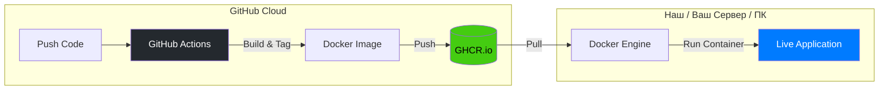
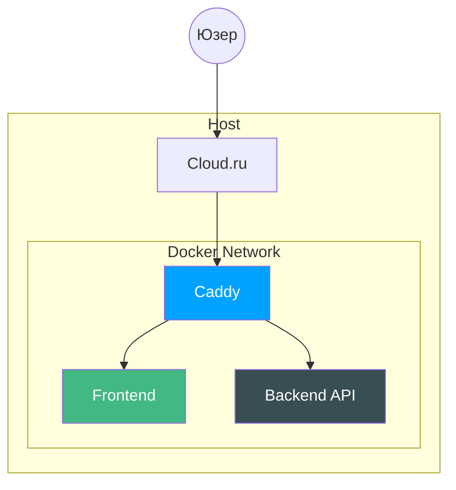

# Создание веб-сайта для нахождения оптимальной рассадки учеников в классе
Даниил Прокофьев, 2026


<div class="abs-bl m-10 flex items-center gap-3 opacity-50">
  <div class="flex gap-1">
    <svg xmlns="http://www.w3.org/2000/svg" width="32" height="32" viewBox="0 0 24 24"><path fill="currentColor" d="m11.89 10.34l-1.34.7c-.14-.3-.31-.51-.52-.63s-.41-.18-.58-.18c-.9 0-1.34.59-1.34 1.77c0 .54.11.97.34 1.29c.22.32.55.48 1 .48c.58 0 .99-.27 1.23-.86l1.23.63c-.26.49-.62.87-1.09 1.15q-.69.42-1.53.42c-.9 0-1.62-.27-2.17-.82C6.58 13.74 6.3 13 6.3 12c0-.95.28-1.7.83-2.26q.84-.84 2.1-.84c1.24-.01 2.13.48 2.66 1.44m5.77 0l-1.32.7c-.14-.3-.34-.51-.53-.63q-.315-.18-.6-.18c-.89 0-1.34.59-1.34 1.77c0 .54.13.97.34 1.29c.23.32.56.48 1 .48c.59 0 1-.27 1.24-.86l1.25.63c-.28.49-.65.87-1.11 1.15c-.47.28-.97.42-1.52.42c-.9 0-1.63-.27-2.17-.82S12.09 13 12.09 12c0-.95.28-1.7.83-2.26S14.17 8.9 15 8.9c1.26-.01 2.14.48 2.66 1.44M12 3.5a8.5 8.5 0 0 1 8.5 8.5a8.5 8.5 0 0 1-8.5 8.5A8.5 8.5 0 0 1 3.5 12A8.5 8.5 0 0 1 12 3.5M12 2A10 10 0 0 0 2 12a10 10 0 0 0 10 10a10 10 0 0 0 10-10A10 10 0 0 0 12 2"/></svg>
    <svg xmlns="http://www.w3.org/2000/svg" width="32" height="32" viewBox="0 0 24 24"><path fill="currentColor" d="M12 2c5.523 0 10 4.477 10 10s-4.477 10-10 10S2 17.523 2 12S6.477 2 12 2m2 8h-4a1 1 0 0 0-1 1v4h1.5v4h3v-4H15v-4a1 1 0 0 0-1-1m-2-5a2 2 0 1 0 0 4a2 2 0 0 0 0-4"/></svg>
    <svg xmlns="http://www.w3.org/2000/svg" width="32" height="32" viewBox="0 0 24 24"><path fill="currentColor" d="M12 2c5.52 0 10 4.48 10 10s-4.48 10-10 10S2 17.52 2 12S6.48 2 12 2m0 4c-2.177 0-4.03 1.67-4.716 4H6l2.5 3l2.5-3H9.401C9.92 8.805 10.89 8 12 8c1.657 0 3 1.79 3 4s-1.343 4-3 4c-1.11 0-2.08-.804-2.598-1.999H7.285C7.97 16.33 9.823 18 12 18c2.761 0 5-2.686 5-6s-2.239-6-5-6"/></svg>
  </div>
  <span class="text-sm border-l border-white/20 pl-2">Презентация лицензирована под CC BY-SA 4.0</span>
</div>

---
layout: center
class: text-center
---

# $7 \pm 2$

число Миллера

---
layout: two-cols-header
class: flex flex-col justify-center
---

# **Постановка задачи**

::left::

> ### Разработать веб-сайт, генерирующий оптимальную рассадку с учетом данных ограничений и предпочтений
Так как задача относится к классу **NP-полных задач**, оптимальное решение за разумное время способны дать только **эвристические алгоритмы**

::right::

#### Какие могут ограничения и предпочтения?

- <carbon-hospital class="text-red-400" /> Ограничения, связанные с **медицинскими предписаниями** (например, ученик должен сидеть за первой партой согласно предписанию врача)
- <carbon-user-avatar-filled-alt class="text-orange-400" /> Ограничения, связанные с **нежелательным соседством** двух учеников (например, двое учеников враждуют)
- <carbon-location class="text-blue-400" /> Предпочтения по **рядам и партам** (например, ученик хочет сидеть на первой парте)
- <carbon-group class="text-pink-400" /> Предпочтения учеников по **соседству** (например, двое друзей хотят сидеть вместе)

<style>
.two-cols-header {
  column-gap: 20px;
}
</style>
---
layout: center
---

# **Какие пути решения существуют?**

---
layout: two-cols-header
class: flex flex-col justify-center
---

# **Жадный алгоритм**

::left::

## Примерный принцип работы (жадность)
- Берем одного ученика
- Смотрим на его предпочтения и ограничения
- Сажаем его на лучшее из свободных мест

## Что не так?
#### Алгоритм может **пропустить лучшее решение** из-за предыдущих неудачных, тем самым **застряв в локальном максимуме**

::right::

``` text
            🏔️Глобальный максимум
           / \
          /   \        🚩Жадный застрял тут! 
  _______/     \      / \
 /              \____/   \
/
```

<style>
.two-cols-header {
  column-gap: 20px;
}
</style>

---
layout: two-cols-header
class: flex flex-col justify-center
---

# **Метод имитации отжига**

::left::

Алгоритм **эффективно** находит **глобальные области**, но критически зависит от времени

**Главные недостатки:**
- **Время:** Требует очень медленного охлаждения.
- **Застревание:** При быстром снижении температуры может застрять

::right::

</img>

#### Здесь алгоритм ищет максимум функции

<div class="mt-8 p-3 bg-orange-400/5 border-l-2 border-orange-400 text-[13px] leading-tight">
  <strong>Проблема:</strong> Если "температура" падает слишком быстро, алгоритм не успевает дойти до идеала и замерзает на субоптимальном решении
</div>

---
layout: two-cols-header
---

# **Генетический алгоритм**

::left::
Алгоритм развивает не одно решение, а целую популяцию, и отбирает лучшие из них

**Механизмы:**
- **Скрещивание:** Объединение признаков двух родителей
- **Мутация:** Случайное изменение для поддержания разнообразия
- **Отбор:** Выживают только лучшие

**Главный минус** - **слепая эволюция**. Алгоритм не пытается улучшить ситуацию, а ждет, пока случайная мутация все исправит, что может занять тысячи поколений и увеличить вычислительную сложность

::right::

<div class="flex flex-col items-center justify-center h-full space-y-4">
  <div class="text-[10px] uppercase opacity-50 mb-1">Генерация шума (много вариантов)</div>
  <div class="grid grid-cols-4 gap-2 opacity-40">
    <div class="w-8 h-4 bg-red-400 rounded-full animate-pulse"></div>
    <div class="w-8 h-4 bg-blue-400 rounded-full"></div>
    <div class="w-8 h-4 bg-yellow-400 rounded-full animate-pulse" style="animation-delay: 0.2s"></div>
    <div class="w-8 h-4 bg-purple-400 rounded-full"></div>
  </div>

  <div class="w-full h-px bg-gradient-to-r from-transparent via-gray-500 to-transparent my-2"></div>

  <div class="flex flex-col items-center scale-110">
    <div class="text-xs font-bold text-orange-400 mb-2 italic">Сито фитнес-функции</div>
    <div class="relative flex space-x-2">
       <div class="flex flex-col items-center opacity-30">
         <div class="w-6 h-6 border-2 border-red-500 flex items-center justify-center rounded">✕</div>
         <span class="text-[8px] mt-1">Плохо</span>
       </div>
       <div class="flex flex-col items-center scale-125 mx-4">
         <div class="w-8 h-8 border-2 border-emerald-500 flex items-center justify-center rounded shadow-[0_0_10px_rgba(16,185,129,0.5)]">
           <div class="w-4 h-4 bg-emerald-500 rotate-45"></div>
         </div>
         <span class="text-[9px] mt-1 text-emerald-400 font-bold uppercase">Выжил</span>
       </div>
       <div class="flex flex-col items-center opacity-30">
         <div class="w-6 h-6 border-2 border-red-500 flex items-center justify-center rounded">✕</div>
         <span class="text-[8px] mt-1">Плохо</span>
       </div>
    </div>
  </div>

  <carbon-arrow-down class="text-gray-400 mt-2" />

  <div class="p-3 bg-emerald-500/10 border border-emerald-500/30 rounded-lg text-center">
    <div class="text-[10px] text-emerald-400 uppercase tracking-widest">Итоговая популяция</div>
    <div class="flex space-x-1 mt-2 justify-center">
      <div class="w-3 h-3 bg-emerald-500 rounded-sm"></div>
      <div class="w-3 h-3 bg-emerald-500 rounded-sm opacity-80"></div>
      <div class="w-3 h-3 bg-emerald-500 rounded-sm opacity-60"></div>
      <div class="w-3 h-3 bg-emerald-500 rounded-sm opacity-40"></div>
    </div>
    <p class="text-[10px] mt-2 leading-tight">Популяция "запоминает" форму <br>успеха через отбор</p>
  </div>
</div>
---
layout: two-cols-header
class: px-2
---

# **Меметический алгоритм**

::left::

Меметический подход объединяет глобальный охват генетики и локальный поиск, что позволяет превносить разнообразие в популяцию и помогает избежать застревания в локальном максимуме

**Как работает**
- **Гены:** Наследуем общую структуру рассадки
- **Локальный поиск:** Совершаем N итераций, пытаясь каждый раз поменять двух случайных учеников местами. Если качество рассадки улучшилось - оставляем

::right::

<div class="flex flex-col items-center justify-center h-full space-y-3">
  
  <div class="w-full p-2 border border-blue-500/30 bg-blue-500/5 rounded">
    <div class="text-[9px] uppercase opacity-60 mb-2">Ввод: Результат работы ген. алгоритма</div>
    <div class="flex justify-center gap-1">
       <div class="w-5 h-5 bg-blue-500 rounded-sm"></div>
       <div class="w-5 h-5 bg-orange-400 rounded-sm shadow-[0_0_8px_rgba(251,146,60,0.5)]"></div>
       <div class="w-5 h-5 bg-blue-500 rounded-sm"></div>
       <div class="w-5 h-5 bg-orange-400 rounded-sm shadow-[0_0_8px_rgba(251,146,60,0.5)]"></div>
       <div class="w-5 h-5 bg-blue-500 rounded-sm"></div>
    </div>
  </div>

  <div class="flex flex-col items-center py-1 relative">
    <div class="flex items-center space-x-2">
      <carbon-arrows-horizontal class="text-orange-400 animate-pulse" />
      <span class="text-[9px] font-bold uppercase text-orange-400 italic">Случайный Swap (30 раз)</span>
    </div>
    <div class="h-6 w-px bg-dashed border-l border-gray-500 opacity-30 mt-1"></div>
    <div class="absolute right-[-40px] top-6 flex flex-col items-start opacity-60">
      <div class="text-[8px] text-green-400">fitness(x') > fitness(x) ?</div>
      <div class="text-[8px] text-red-400">Да → оставляем</div>
    </div>
  </div>

  <div class="w-full p-2 border border-emerald-500/50 bg-emerald-500/10 rounded shadow-[0_0_15px_rgba(16,185,129,0.2)]">
    <div class="text-[9px] uppercase text-emerald-400 mb-2">Локальный Оптимум</div>
    <div class="flex justify-center gap-1">
       <div class="w-5 h-5 bg-blue-500 rounded-sm"></div>
       <div class="w-5 h-5 bg-emerald-500 rounded-sm"></div>
       <div class="w-5 h-5 bg-blue-500 rounded-sm"></div>
       <div class="w-5 h-5 bg-emerald-500 rounded-sm"></div>
       <div class="w-5 h-5 bg-blue-500 rounded-sm"></div>
    </div>
    <div class="text-[8px] text-emerald-400 mt-2 text-center font-mono">Фитнес улучшен на +12%</div>
  </div>

  <div class="text-[9px] opacity-60 text-center leading-tight">
    Метод "восхождения к холму": <br> 
    принимаем изменения, только если они <br> делают рассадку лучше здесь и сейчас
  </div>
</div>

---
layout: default
---

# **Как хранить рассадки в памяти?**
--

Для удобства работы с функциями мутации, скрещивания и фитнеса было принято решение использовать одномерные массивы. Их удобно хранить в памяти и совершать различные операции

```text
[1, 3, 5, 6, 7, 2, 4, 8, 9, 10] - класс размером 2 ряда * 5 парты в ряду, но только 8 учеников
```
```text
 1        3
 5        6
 7        2
 4        8
9(-1)   10(-1)
```

Для индексов больше, чем количество учеников будем считать, что это место пустует. Они при сборке ответа будут обозначаться как -1

---
layout: default
---

# **Как работает меметический алгоритм?**
```go
for gen := 0; gen < generations; gen++ {
		// ... оценка каждой особи в популяции, ускоренное с помощью параллелизации ...
    
		iBest := 0
		for i := 1; i < popSize; i++ {
			if scores[i] > scores[iBest] {
				iBest = i
			}
		}

		if scores[iBest] > (bestFitnessEver + 0.001) {
			bestFitnessEver = scores[iBest]
			stagnationCounter = 0
		} else {
			stagnationCounter++
		}

		if stagnationCounter >= stagnationLimit {
			// ранний выход если результат перестал улучшаться
			break
		}
```

---

# **Как работает меметический алгоритм?**
```go
		mutationRate := 0.15
		if stagnationCounter > 50 {
			mutationRate = 0.4
		}
		copy(newPop[0], population[iBest])
		localSearch(rands[0], newPop[0], req.ClassConfig, weights, friends, enemies, staticScores, ...)
		for w := 0; w < numCPU; w++ {
			// ...
			go func(s, e int, r *rand.Rand) {
				defer wg.Done()
				for i := s; i < e; i++ {
					p1Idx := tournamentSelection(r, scores, 3)
					p2Idx := tournamentSelection(r, scores, 3)
					CrossOver(r, population[p1Idx], population[p2Idx], newPop[i], usedBufs[i])
					if r.Float64() < mutationRate {
						SwapMutation(r, newPop[i])
					}
				}
			}(start, end, rands[w])
		}
		wg.Wait()
		population, newPop = newPop, population
		totalGens++
	}
```

---
layout: two-cols-header
class: px-4 flex flex-col justify-center
---

# **Фитнес-функция: как оценить рассадку?**

::left::

<div class="pr-4">

$$S_{total} = \frac{1}{N} \sum_{i=1}^{N} \frac{F_i \cdot W_{fr} - E_i \cdot W_{en} + S_{stat, i}}{W_{fr} + W_{en} + W_{med} + W_{pref}}$$

<div class="text-sm opacity-90">

- $S_{total}$ — итоговый коэффициент приспособленности
- $N$ — количество учеников в классе
- $F_i, E_i$ — кол-во друзей и врагов в радиусе $R$
- $W_{x}$ — весовые коэффициенты значимости (друзья, враги, медицина, предпочтения)
- $S_{stat, i}$ — сумма баллов за медицинские требования и выбор места

</div>
</div>

::right::

<div class="bg-primary/10 p-4 rounded-lg border border-primary/20">

### Интерпретация
Функция нормализована относительно **теоретического максимума** --- рассадки, где у **каждого** есть **предпочтения** и все они выполнены

</div>

---
layout: two-cols-header
class: px-1
---

# **Как работает проверка предпочтений?**

::left::

Каждая функция, которая что-то проверяет, возвращает **нормализованное значение** от 0.0 до 1.0
Такая функция считает учтенность какого-либо предпочтения для отдельного ученика и делит полученное значение на максимальное значение учтенности этого конкретного предпочтения

Затем, значение этой функции умножается на некий вес, который пришел с фронтенда.

::right::

```go
// функция проверки учтенности предпочтений по рядам и партам
func checkPref(student optStudent, row, col int) float64 {
	score := 0.0
	maxPossible := 0.0
	if len(student.pCols) > 0 {
		maxPossible += 1.0 // если есть предпочтения по рядам
	}
	if len(student.pRows) > 0 {
		maxPossible += 1.0  // если есть предпочтения по партам
	}
	if maxPossible == 0 {
		return 1.0 // если предпочтений вообще нету
	}
	if student.pCols[col] {
		score += 1.0 // если предпочтение по ряду выполнено
	}
	if student.pRows[row] {
		score += 1.0 // если предпочтение по парте выполнено
	}
  // возвращаем нормализованное значение от 0.0 до 1.0
	return score / maxPossible
}
```

---
layout: two-cols-header
class: flex flex-col justify-center px-2
---

# **Веса в фитнес функции**

::left::

Самая важная часть алгоритма. От того, как конкретно функция fitness оценит рассадку, зависит, куда дальше пойдет эволюция.
Однако, у каждого пользователя могут быть разные запросы. Поэтому важно разработать максимально гибкую и настраиваемую систему

Вместе с запросом к бекенду посылаются **веса** - какие предпочтения учитывать больше, а какие меньше. От их правильной настройки зависит качество решения

::right::

```json
...
"PriorityWeights": {
          "Medical": 0.9,
          "Friends": 0.65,
          "Enemies": 0.7,
          "Preferences": 0.6,
          "Fill": 0.3
      }
...
```

---
layout: two-cols-header
---

# **Почему в качестве языка бекенда выбран Go?**

::left::


::right::

- Go язык компилируемый =>

  -- Легкость развертывания (всего один бинарный файл, который можно запустить где угодно)
 
  -- Работает быстрее пресловутого Python
- Параллельные вычисления с помощью горутинов
- Масштабируемость и приспособленность языка к реализации на нем высоконагруженных микросервисов
- Простой, минималистичный синтаксис
- Строгая типизация позволяет избежать досадных ошибок
---
layout: two-cols
---

# **"Архитектура"**

* Backend (Go)
  * Выполнение меметического алгоритма, чтобы не сломать школьные компьютеры
* Frontend (Vue 3)
  * Клиентское приложение для настройки параметров и весов, визуализация результата
* Взаимодействие (REST API)
  * Обмен данными через JSON-объекты, возможность работы с другими клиентами
* Инфраструктура (Docker + Github Actions)
  * Развертывание одной командой без установки зависимостей

::right::

<div class="flex flex-col items-center justify-center h-full">
  <div class="p-3 border-2 border-emerald-500 rounded-lg bg-emerald-500/10 w-48 text-center">
    <carbon-code class="mb-1" />
    <div class="text-xs font-bold">Backend (Go)</div>
    <div class="text-[10px] opacity-70">Вычисления и логика</div>
  </div>
  
  <div class="h-8 w-0.5 bg-gray-500 my-1 border-dashed border-l-2"></div>
  <div class="text-[10px] text-orange-400 font-mono">JSON API</div>
  <div class="h-8 w-0.5 bg-gray-500 my-1 border-dashed border-l-2"></div>

  <div class="p-3 border-2 border-blue-500 rounded-lg bg-blue-500/10 w-48 text-center">
    <carbon-screen class="mb-1" />
    <div class="text-xs font-bold">Frontend (Vue 3)</div>
    <div class="text-[10px] opacity-70">Визуализация и UX</div>
  </div>
</div>
---
layout: two-cols-header
class: px-1
---

# **Как выглядит запрос к серверу?** 

::left::

```json
{
    "students": [
        {
            "id": 1767369989264,
            "name": "Иван",
            "preferredRows": [],
            "preferredColumns": [],
            "medicalPreferredRows": [],
            "medicalPreferredColumns": []
        },
        {
            "id": 1767369995544,
            "name": "Петр",
            "preferredRows": [],
            "preferredColumns": [],
            "medicalPreferredRows": [],
            "medicalPreferredColumns": []
        },
        {
            "id": 1767369998215,
            "name": "Елизавета",
            "preferredRows": [],
            "preferredColumns": [],
            "medicalPreferredRows": [],
            "medicalPreferredColumns": []
        }
    ],
```

::right::

```json
  "preferences": [
          [
              1767369989264,
              1767369995544
          ]
      ],
      "forbidden": [
          [
              1767369995544,
              1767369998215
          ]
      ],
      "classConfig": {
          "rows": 3,
          "columns": 4
      },
      "PriorityWeights": {
          "Medical": 0.9,
          "Friends": 0.65,
          "Enemies": 0.7,
          "Preferences": 0.6,
          "Fill": 0.3
      }
}
```

<style>
pre {
  max-height: 400px;
  overflow-y: hidden;
  font-size: 0.6rem !important;
  line-height: 1.2 !important;
}
</style>
---
layout: default
---

# **Дружественный интерфейс...**


---


---


---


---


---
layout: two-cols-header
class: px-1
---

# **Что использовано?**
смотрим на package.json проекта

::left::

```json
{
  "name": "frontend",
  "private": true,
  "version": "0.0.0",
  "type": "module",
  "scripts": {
    "dev": "vite",
    "build": "vite build",
    "preview": "vite preview"
  },
  "dependencies": {
    "@popperjs/core": "^2.11.8",
    "axios": "^1.13.2",
    "bootstrap": "^5.3.8",
    "bootstrap-vue-next": "^0.40.9",
```

::right::
```json
    "jspdf": "^4.0.0",
    "jspdf-autotable": "^5.0.7",
    "papaparse": "^5.5.3",
    "unplugin-icons": "^22.5.0",
    "vue": "^3.5.26",
    "vue-router": "^4.6.4",
    "vuedraggable": "^4.1.0"
  },
  "devDependencies": {
    "@iconify-json/bi": "^1.2.7",
    "@vitejs/plugin-vue": "^6.0.3",
    "unplugin-vue-components": "^29.2.0",
    "vite": "^7.3.1"
  }
}
```
---

# **Структура файлов фронтенда**

```text
.
├── Caddyfile
├── Dockerfile
├── index.html
├── LICENSE
├── package-lock.json
├── package.json
├── public
│   └── fonts
│       └── Roboto-Regular.ttf // лицензирован Apache License, v. 2.0
├── src
│   ├── App.vue
│   ├── ClassEditor.vue
│   ├── ClassesList.vue
│   ├── ClassMap.vue
│   ├── composables
│   │   ├── useClasses.js
│   │   └── useSeating.js
│   ├── Generator.vue
│   ├── main.js
│   └── SeatingHistory.vue
└── vite.config.js
```
---
class: flex flex-col justify-center
---

# **Почему все запускается одной командой?**

- Триггер: Push в ветку main.
- Сборка: Сборка Docker-образа фронта и бэка.
- Загрузка образа: Пуш в GitHub Container Registry (GHCR).
- Развертывание: Обновление контейнеров на сервере через WatchTower / запуск вручную через ```docker compose up```



---
layout: two-cols-header
class: flex flex-col justify-center items-start
---

# **Прямо во Всемирную паутину!**

::left::

- **Домен:** `seating-generator.ru`
- **Провайдер:** Cloud.ru (VPS на Linux, Cloud Free Evolution Tier)

### Архитектура
- **Caddy:** Реверс-прокси + SSL
- **Docker:** Те самые контейнеры
- **Безопасность:** Весь трафик только через прокси

::right::


<div class="scale-120 origin-left ml-12">


</div>

---
layout: center
---

# **Демонстрация работы**
---

<div class="flex justify-center">
  <video 
    src="/demo.mp4" 
    controls 
    muted 
    class="w-1024 rounded-lg shadow-xl"
  ></video>
</div>
---
layout: two-cols-header
class: flex flex-col justify-center
---

# **Лицензирование**

::left::

### **GNU Affero GPL v3.0**

- **Copyleft:** Любые изменения должны распространяться на тех же условиях
- **Remote Network Interaction:** Если сервис доступен через сеть, исходный код **обязан** быть открыт
- **Прозрачность:** Пользователь имеет право знать, как обрабатываются его данные

### **Что это значит для проекта?**

- **Доступность:** Ссылка на репозиторий закреплена в Navbar приложения
- **Свобода:** Любой желающий может развернуть свою копию для школы или университета

::right::

</img>

---
layout: center
class: text-center
---

# **Изучить проект**

<div class="flex flex-col items-center mt-8">
  <div class="p-4 bg-white rounded-xl shadow-2xl">
    
  </div>
  
  <p class="mt-4 text-xl font-mono">github.com/dvprokofiev/seating-generator</p>
  
  <div class="mt-6 flex gap-4 opacity-70">
    <span class="flex items-center gap-1"><div class="i-mdi-docker" /> Go</span>
    <span class="flex items-center gap-1"><div class="i-mdi-github" /> Vue</span>
    <span class="flex items-center gap-1"><div class="i-mdi-github" /> Docker</span>
    <span class="flex items-center gap-1"><div class="i-mdi-web" /> AGPLv3</span>
  </div>
</div>

<p class="mt-12 text-sm opacity-50">
  Проект оптимизирован для работы в десктопных браузерах.<br>
  QR-код ведет на документацию и исходный код
</p>